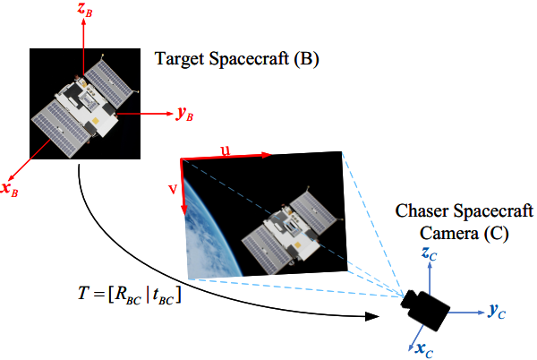
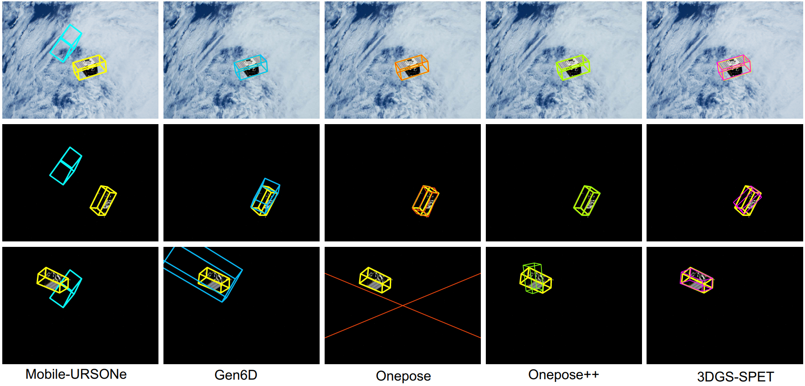

# 3DGS-SPET: Incorporating 3D Gaussian Splatting for Spacecraft Pose Estimation and Tracking Based on Monocular Vision

https://github.com/user-attachments/assets/e3b8629c-90ef-4c0d-9a9b-8b91612869c6


## Abstract 
Accurate spacecraft pose estimation and tracking constitutes a critical enabling technology for space exploration missions and on-orbit servicing operations. However, two significant challenges persist: 1) the majority of pose estimation methods exhibit a pronounced dependence on refined depth information or prior 3D reference models, this dependency renders these methods inapplicable to non-cooperative targets; 2) the complex and dynamic space environment could severely compromises pose estimation accuracy. To address these challenges, we propose a novel spacecraft pose estimation and tracking network incorporating 3D Gaussian splatting, termed 3DGS-SPET, that aims to implement instance detection, 3D model reconstruction, and 6DoF pose estimation and tracking for non-cooperative or unknown targets using only RGB images from a monocular vision sensor. The methodology has two application modes: single-frame pose estimation and consecutive-frame pose tracking. single-frame pose estimation encompasses four sequential stages: (i) instance detection of the target spacecraft, (ii) initial pose inference based on semantic features and segmentation masks, (iii) 3D model reconstruction via 3D Gaussian splatting, (iv) iterative pose optimization through 3D Gaussian rendering. Building upon single-frame pose estimation, Consecutive-frame pose tracking associates and jointly optimizes temporally adjacent target poses across image sequences, thereby further enhancing target tracking accuracy and stability. We conduct an evaluation using the spacecraft pose estimation dataset from the SPARK 2024 Challenge. Compared to other state-of-the-art methods, our method achieves more competitive results, with an average translation error of 0.12 m and an average rotation error of 4.4°.



## Environment Setup 

cd 3DGS-SPET

conda env create -f environment.yaml

conda activate 3DGS-SPET

bash install_env.sh  

## Download the datasets

### 1) Training Dataset:

- [``MegaPose/gso_1M``](https://www.paris.inria.fr/archive_ylabbeprojectsdata/megapose/webdatasets/) 
- [``MegaPose/google_scanned_objects.zip``](https://www.paris.inria.fr/archive_ylabbeprojectsdata/megapose/tars/) 


### 2) Testing Dataset:
- [SPARK 2024: Datasets for Spacecraft Semantic Segmentation and Spacecraft Trajectory Estimation Dataset](https://https://cvi2.uni.lu/spark-2024-dataset/)


## Data Preparation

Training dataset are organised under the ``dataspace`` directory, as below,

```
dataspace/
├── MegaPose/
│   ├── webdatasets/gso_1M
│   └── google_scanned_objects
...
```

Testing dataset are organised under the ``SPARK2024`` directory, as below,

```
SPARK2024
├── RT509
├── RT519
├── RT529
├── RT539
├── RT549
├── RT559
├── RT569
├── RT579
├── RT589
├── RT599

```

## Evaluation

We utilize the [SPARK2024 spacecraft pose estimation competition dataset](https://https://cvi2.uni.lu/spark-2024-dataset/) for evaluation, and compare our approach with advanced pose estimation methods such as [Mobile-URSONet](https://github.com/possoj/Mobile-URSONet), [Gen6D](https://liuyuan-pal.github.io/Gen6D/) , [OnePose](https://zju3dv.github.io/onepose/), and [OnePose++](https://zju3dv.github.io/onepose_plus_plus/).

The 3DGS-SPET program for pose estimation and tracking is provided in

```
demo/
├── pose-estimation
├── pose-tracking
```

Single-frame pose estimation:
- ``python pose-estimation.py --obj_name RT509 ``

Consecutive-frame pose tracking:
- ``python pose-tracking.py  --obj_name RT509 ``


## Pose Tracking Visualization

Except for single-frame pose estimation, 3DGS-SPET further extends to pose tracking across consecutive frames.
For relevant visualization results, please download from [here](https://drive.google.com/file/d/1fjRpKm-XvrkuvEF29_QlvCWKStn-nBr4/view?usp=drive_link). 

https://drive.google.com/file/d/1fjRpKm-XvrkuvEF29_QlvCWKStn-nBr4/view?usp=drive_link



## Training
We utilize a subset (``gso_1M``) of the MegaPose dataset for training.

execute the following script under the [``MegaPose``](https://github.com/megapose6d/megapose6d?tab=readme-ov-file) environment for preparing the training data.
- ``python dataset/extract_megapose_to_BOP.py`` 

Then, train the network via
- ``python training/training.py`` 

      
## Acknowledgement
Our work are based on [3D Gaussian Splatting](https://github.com/graphdeco-inria/gaussian-splatting?tab=readme-ov-file) and [MegaPose](https://github.com/megapose6d/megapose6d), and we use their code. If you use the part of code related to data generation, testing and evaluation, you should cite these paper and follow their license.


## Citation
If you find this project useful, please cite:
```
@article{,
  title={3DGS-SPET: Incorporating 3D Gaussian Splatting for Spacecraft Pose Estimation and Tracking Based on Monocular Vision},
  author={Yuan Li, Dapeng Wu, Yaping Cui, Peng He, Yuan Zhang and Ruyan Wang},
  journal={Arxiv},
  year={2025}
}
```
